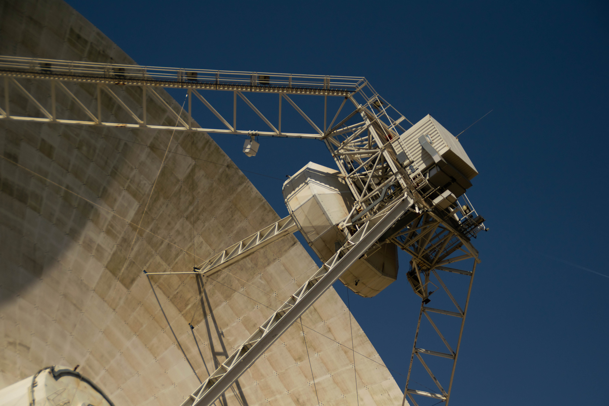

# BLISS pipeline for SETI at the Sardinia Radio Telescope👽🏖️

This repository is the final product of my work at the SRT as part of the Breaktrough Listen 2025 summer internship, which consisted in:
1. Setting up a BLISS pipeline for the SRT computers.
2. Using it to analyze the observations made between the 28th of January and the 8th of July.
3. Evaluate how BLISS performs.

Everything is documented in this [report](./bliss_guide_SRT.md).

## Contents

📂 **guide_images** → plots contained in the report.

📄 **bliss_guide_srt.md** → the aforementioned report.

🐍 **BLISS_pipeline_gc.py** → executable BLISS pipeline for Galactic Center targets.

🐍 **BLISS_pipeline_gc.py** → executable BLISS pipeline for Tess Input Catalog targets.

🐍 **datax_h5_converter.py** → executable that converts and sorts automatically the correct files in the `/datax/` folder.

📄 **README.md** → the file you are reading.

🐍 **TS_find_hits.py** → executable running the TurboSeti narrowband signal search, used for BLISS comparison.

📷 **SRT.jpg** → a picture I took of the SRT dish.

